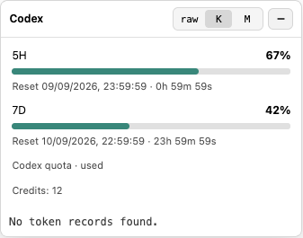

# ChatGPT Usage HUD

[English](README.md) · [测试说明](docs/TESTING.md) · [MIT 许可证](LICENSE)

在 **macOS ChatGPT/Codex 桌面应用的现有窗口内**显示 Codex 用量。收起时放在 header 的空白位置，以进度条显示 5 小时和 7 天额度；展开后查看重置倒计时、可用 credits 和会话 token 信息。

**百分比代表“已使用”，不是剩余。它不代表所有 ChatGPT 模型的额度。** 数据来自应用内置 Codex 服务当前登录的 Codex 账号。




以上截图均为模拟数据，不包含真实账号用量。

## 使用条件

- macOS，以及集成 Codex 的 ChatGPT 桌面应用或兼容的 Codex 桌面应用。
- 已登录 Codex；应用安装包包含 `Contents/Resources/codex`。
- 可正常执行的 **Python 3.10 或更新版本**。日常使用不需要安装 pip 依赖。安装器依次尝试现有 Python、常见 Homebrew 路径，以及可用的 Codex 内置 Python。
- 应用版本支持 Chromium 本机远程调试参数。不含 Codex renderer／内置服务的独立原生 ChatGPT 客户端不支持本工具。

最初在 Apple Silicon、ChatGPT **26.901.51231**、内置 Codex **0.153.4** 上验证。应用更新可能改变兼容性，未保证其他版本均可使用。

## 安装并随 App 自动启动

1. 下载 Release 中的 `chatgpt-usage-hud-v0.1.0.zip`，或使用仓库的 **Code → Download ZIP**。
2. 完整解压，确保 `scripts` 文件夹和 `install.sh` 放在一起。
3. 先完成或保存 App 中正在进行的工作。打开“终端”，输入 `cd `，把解压后的文件夹拖进终端，再按回车。
4. 执行：

```sh
bash install.sh
```

不需要 `sudo`。安装器会把运行文件复制到：

```text
~/Library/Application Support/chatgpt-usage-hud/runtime
```

并注册仅对当前用户生效的后台服务：

```text
~/Library/LaunchAgents/com.local.chatgpt-usage-hud.plist
```

这样可以避开 macOS 对后台服务读取 Downloads/Documents 的限制，无需修改系统隐私权限。安装后可以移动解压目录，但不要移除所使用的 Python。

### 平时打开 App 后会发生什么

- App 关闭时，服务只等待，**不会自行打开 App**。
- 正常打开 App 后，HUD 通常需要约 15–30 秒出现。
- 如果没有本机调试连接，服务会请求 App **正常退出并重开一次**，加入 loopback 调试参数；不会强制退出。
- 如果 App 暂时拒绝退出，服务至少等待 60 秒再试。请先完成或保存正在进行的工作，再等待重试。
- 如果 App 成功重开却不支持调试，服务不会不停重启同一个进程。请参考下方疑难排解。
- 已注册为用户登录后自动加载；完整注销／重新登录的验收测试尚未完成。

可用 `bash install.sh --port 9333` 指定起始端口。若端口被其他程序占用，会自动选择其他空闲端口。

## 日常操作

- **收起状态：**5H／7D 的数字与进度条均表示已使用比例。点击 **+** 或精简标签展开。
- **展开状态：**查看重置时间、倒计时、可取得的 credits，以及 context／turn／session token。raw／K／M 只切换 token 数字单位。
- **拖动：**拖动展开面板顶部的空白区域。点击 **−** 收起后回到 header。
- **窗口太窄：**没有安全的 header 空间时改为浮动，不遮挡原本按钮。
- **更新频率：**额度每 120 秒后台读取一次，session 每 10 秒刷新，倒计时每秒更新。
- **缺失或过期：**`—` 表示无法取得数据，不是零。超过 240 秒的数据会标记过期。倒计时结束显示“等待更新”，不会自行假定额度已经重置。
- 跟随 App 的深浅色主题；没有 session 的页面仍可显示额度。

## 更新版本

下载并解压新版，在新版目录重新执行 `bash install.sh`。安装器会更新运行副本并重新加载同一个服务。**仅修改源码或拉取仓库，不会自动更新已安装副本。** App 对话、session 文件和登录资料不会被移除。

## 停用或卸载

在解压目录执行：

```sh
bash uninstall.sh
```

这会停用自动启动并移除本项目的 LaunchAgent 注册文件，保留运行副本和 App 数据。随后正常退出并重开 App，即可移除当前 HUD、关闭本机调试端口。

只想暂时停止而不移除注册文件，可执行：

```sh
launchctl bootout "gui/$(id -u)/com.local.chatgpt-usage-hud"
```

重新执行 `bash install.sh` 即可恢复。上游的 `scripts/install_launch_agent.sh`／`scripts/uninstall_launch_agent.sh` 使用不同服务名称，不属于本发行版的安装流程。

## 疑难排解

| 现象 | 检查或处理方式 |
| --- | --- |
| 刚启动看不到 HUD | 等待约 15–30 秒；若 App 拒绝退出，在完成工作后至少再等 60 秒。 |
| 一直没有出现 | 执行下方服务状态命令；未找到服务时，从最新解压包重新安装。 |
| 服务运行但无 HUD | 检查本机端口；完成工作后重启服务，App 可能正常重开一次。 |
| Python／Xcode 报错 | 安装器会尝试其他可用 Python，不会替你接受 Xcode 许可或修改 Xcode 设置；若全部不可用，请从可信来源安装 Python 3.10+ 后重试。 |
| Documents 下出现 `Operation not permitted` | 使用本发行版的 `install.sh`，让运行文件进入 Application Support；不要让自建 LaunchAgent 直接引用 Documents 内的源码。 |
| 额度不可用 | 确认 Codex 已登录且 App 有内置服务，等待下一次更新；不要在 issue 中粘贴认证文件或 token。 |
| App 更新后失效 | 可能是 renderer 或调试支持改变。重新安装当前发行版，并仅提供 App 版本和已去除隐私信息的错误。 |

```sh
# 服务状态；running 不等于已经在窗口显示成功
launchctl print "gui/$(id -u)/com.local.chatgpt-usage-hud"

# 默认本机端口；自定义或自动改用其他端口时请替换
lsof -nP -iTCP:9222 -sTCP:LISTEN

# 完成 App 内工作后重启本服务
launchctl kickstart -k "gui/$(id -u)/com.local.chatgpt-usage-hud"
```

## 隐私与限制

通过运行时 CDP／DOM 注入显示 HUD，并使用官方本机 `account/rateLimits/read` 协议。不会修改 App 安装包、要求 API key、兑换 reset credits，或把资料上传到第三方用量服务。官方内置服务可能连接 OpenAI 以取得额度。

只有规范化的额度字段进入 HUD；用量快照只留在内存，已安装服务不保存标准输出／错误日志。原有本机 session 日志仅用于读取 token 信息。仓库和安装包不包含私人聊天移交文件、账号用量快照、凭据或开发记录中的个人本机路径。

本机调试可以让本机进程访问 renderer，因此仅绑定 loopback，不要开放给局域网。停止自动服务后，再正常退出并重开 App，即可关闭调试连接。

## 来源与署名

基于 [KevinKE93/Codex-Monitor](https://github.com/KevinKE93/Codex-Monitor)，上游版本 `56b2ea3`。保留原 MIT 版权与许可证。本衍生版增加 Codex 额度、header 进度条、安全重试和可移植安装器。界面的“Made by Kevin”已移除，但本文和 LICENSE 保留原作者署名。本项目独立开发，并非 OpenAI 官方产品。
